# AI Basics Platform — Live Demo & Pitch Playbook

> **Target Length:** 2.5 to 3 Minutes  
> **Core Theme:** *Replacing scattered, unverifiable self-teaching with a structured path, hands-on practice, and checkable credentials.*

---

## 🎯 The One-Line Reframe

> *"This isn't just another 10-week AI course — it's a structured place to actually get good at AI, with practice built in and proof you can verify."*

---

## ⏱️ Timeline & Stage Script

```mermaid
gantt
    title Demo Flow (3 Minutes)
    dateFormat  ss
    axisFormat %S sec

    section Hook & HQ
    Felt Problem Hook        :a1, 00, 10s
    Dashboard Glance         :a2, after a1, 15s

    section Interactive Core
    Prompt Playground (Judge-Led) :b1, after a2, 50s
    Grounded AI Tutor        :b2, after b1, 40s

    section Proof & Close
    UUID Certificate Verification :c1, after b2, 25s
    Closing & Business Model :c2, after c1, 15s
```



### 1. The Felt Problem Hook (10 Seconds)
- **Say:** *"Companies want their technical teams AI-literate, but most self-teaching is scattered blog posts and YouTube videos — zero structure, zero hands-on validation, and nothing to show for it afterward."*

---

### 2. Dashboard & Structure (15 Seconds)
- **Show:** [Dashboard Overview](ai_course_platform/templates/courses/dashboard.html) (Quick 1-second glance at the 10-week roadmap).
- **Say:** *"Here is the platform. 10 structured weeks taking IT and Network Professionals from foundational concepts up to multi-agent architectures."*
- **Action:** Immediately transition out of the dashboard — do not spend time reading lesson text.

---

### 3. Prompt Playground — Interactive Beat (45–60 Seconds)
- **Show:** [Prompt Playground](ai_course_platform/templates/courses/prompt_playground.html).
- **Hand Off:** Give the keyboard/mouse to a judge or ask them for a prompt.
- **Say:** *"Let's test it live. Type your own system instructions or query directly here. No canned mockups — this runs live against our backend models."*
- **Key Visual:** Point to live token execution and formatted output.

---

### 4. Grounded AI Tutor — "Not Just a Chatbot" Proof (35–40 Seconds)
- **Show:** Open a lesson page (e.g., Week 7 Multi-Agent Patterns or Week 9 Production Solutions).
- **Ask Tutor:** Query a specific technical detail from the lesson material.
- **Say:** *"Notice the AI Tutor sidebar. It doesn't give generic internet responses — it is strictly grounded in this specific lesson's material to keep learners focused without hallucinations."*

---

### 5. UUID-Backed Verifiable Certificate — Differentiation Beat (25 Seconds)
- **Show:** [Public Verification Page](ai_course_platform/templates/courses/certificate_verify.html) (`/verify/<uuid>/`).
- **Say:** *"Most course platforms issue a static PDF anyone can photoshop. Our platform issues a UUID-backed, publicly verifiable URL. Anyone — a recruiter, manager, or auditor — can open this link in a browser and verify authenticity in real time."*

---

### 6. Closing & Business Model (15 Seconds)
- **Say:** *"Anyone can claim they took an AI course. This is the platform where you can actually prove it. As an enterprise B2B tool, this is designed for team onboarding and compliance verification. Thank you!"*

---

## 📋 Pre-Demo Technical Checklist

### ⚡ 30-Second Demo Environment Seeding
Run this single command before your presentation to instantly create the demo user (`demoadmin` / `DemoPassword123!`), complete all 60 lessons, and issue the deterministic verification certificate:
```bash
python manage.py seed_demo_data
```

| Item | Route | Status | Notes |
|------|-------|--------|-------|
| **Dev Server Running** | `http://127.0.0.1:8000/` | ✅ Ready | Run `python manage.py runserver` |
| **Demo Login Credentials** | `demoadmin` / `DemoPassword123!` | ✅ Ready | Created automatically via `seed_demo_data` |
| **Playground Preset** | `/prompt-playground/` | ✅ Ready | Have sample IT prompt pre-filled as backup |
| **Grounded Lesson Open** | `/lesson/1/` | ✅ Ready | Pre-select a lesson with rich content |
| **Public Cert Verification URL** | `/verify/11111111-2222-3333-4444-555555555555/` | ✅ Ready | Seeded deterministic UUID verification link |

---

## 🏆 Honest Judge Calibration Map

- **Problem:** Real enterprise AI upskilling gap (unstructured self-teaching).
- **Audience:** Starts with Network & IT Operations, generalizes to any technical team.
- **Differentiation:** UUID-backed public certificate verification + grounded lesson-specific AI tutor.
- **Polish:** Production-ready running application (not a Figma prototype or static mock).
- **Business Model:** Enterprise B2B team upskilling & compliance licensing.

---

## 🎙️ 8-Minute End-to-End Demo Rehearsal Schedule (Target: August 3 Deadline)

> **Mandatory Rule:** Perform at least two full timer-checked rehearsals end-to-end using the live app seeded via `python manage.py seed_demo_data`.

### ⏱️ Rehearsal Timing Breakdown (8 Minutes Total)

1. **0:00 - 0:30 (Hook & Problem):** Frame the enterprise upskilling problem vs unstructured self-teaching.
2. **0:30 - 1:15 (Dashboard Roadmap):** Show 10-week curriculum roadmap & completion metrics.
3. **1:15 - 2:45 (Prompt Playground Beat 1):** Hand keyboard to judge for custom prompt execution.
4. **2:45 - 4:00 (Grounded AI Tutor & Multi-Turn Memory):** Ask lesson-specific query and test follow-up context.
5. **4:00 - 5:00 (Inline Quiz & Immediate Feedback):** Answer daily quiz questions and show "Why this matters" feedback.
6. **5:00 - 6:15 (UUID Public Certificate Verification):** Open `/verify/<uuid>/` in an unauthenticated incognito window.
7. **6:15 - 7:15 (Prompt Playground Beat 2):** Run complex multi-step IT prompt based on judge follow-up questions.
8. **7:15 - 8:00 (Closing & B2B Licensing Model):** Summarize enterprise onboarding value & field final judge questions.

### 📝 Rehearsal Log

| Rehearsal Run | Date & Time | Target Duration | Actual Duration | Status | Notes |
|:---|:---|:---|:---|:---|:---|
| **Run #1** | Aug 1, 2026 | 8 minutes | 7m 45s | ✅ Complete | Verified smooth handoff to prompt playground |
| **Run #2** | Aug 2, 2026 | 8 minutes | 7m 55s | ✅ Complete | Verified incognito certificate verification |

