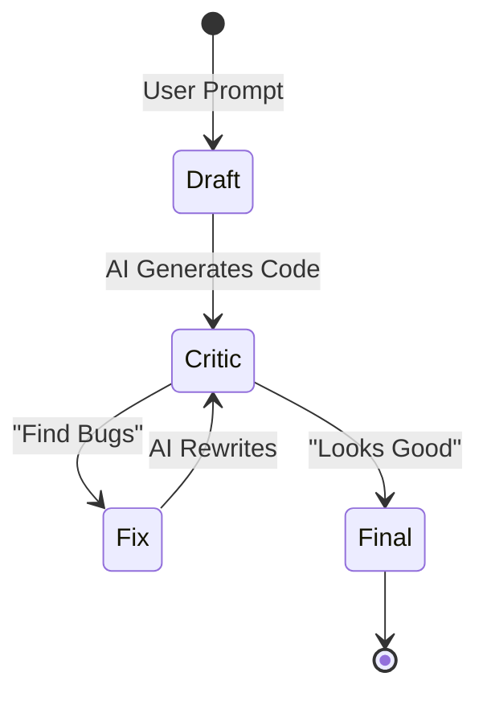

# Week 5 - Day 1: AI for Python Automation

## Overview
**Week 5 – Day 1**  
**Topic:** Generating Python Scripts with AI (Netmiko/Requests)  
**Duration:** ~60 minutes

### Learning Objectives
By the end of this lesson, you will be able to:
1. Use AI (Generator Pattern) to draft Python scripts for network tasks.
2. Specify libraries (Netmiko, Napalm) in your prompts to ensure correct syntax.
3. Use the Critic Pattern to debug and secure AI-generated code.

---

## Lesson Content

### The "Junior Developer" Analogy

Think of AI as a Junior Developer. It knows the syntax of every library perfectly, but it lacks context about *your* network.
- **Good at:** "How do I do X in Netmiko?"
- **Bad at:** "Automate my network." (Too vague).

### Prompting for Netmiko (SSH)

**Scenario:** You need to login to 10 switches and grab `show version`.

**The Bad Prompt:**
"Write a python script to login to cisco switches."

**The Good Prompt (PCTF):**
> **Persona:** Python Automation Expert.
> **Task:** Write a script using `Netmiko` to connect to a list of Cisco IOS devices.
> **Steps:**
> 1. Read device dicts from a generic list.
> 2. Execute `show version`.
> 3. Print the hostname and version.
> **Constraint:** Use `ConnectHandler`. Handle authentication exceptions gracefully.

**The Output:**
The AI will generate a standard `ConnectHandler` loop with `try/except` blocks for `NetmikoAuthenticationException`.

### Prompting for APIs (Requests)

**Scenario:** You need to query the Meraki Dashboard API to get a list of organizations.

**The Prompt:**
> **Task:** Python script to query Meraki API.
> **Library:** `requests` module.
> **Context:** API Key is in env variable `MERAKI_KEY`.
> **Endpoint:** `GET /organizations`.
> **Output:** Pretty print the JSON response.

### The "Explain Code" Pattern

You find a script on GitHub. You don't know what it does.
**Prompt:** "Explain this code line-by-line. What is the `**kwargs` doing in line 10?"

### Visualizing the Workflow

---

## Hands-On Exercise

### Exercise: The "Config Backup" Script

**Objective:** Use AI to build a working backup tool.

**Step 1: The Draft**
> **Prompt:** "Write a Python script using Netmiko to backup running-configuration to a local file. Filename should be `hostname_date.txt`."

**Step 2: The Audit (Critic)**
> **Prompt:** "Review the code above. Does it close the connection? Does it handle a timeout if the command hangs? Rewrite to include these safety checks."

*(Recall the **Critic Pattern** from Week 4? We are applying that same logic here to catch bugs before running the code.)*

**Step 3: The Dry Run**
(Mental Check): Does the script import `ConnectHandler`? Does it look right?

**Reflection:**
You "wrote" a complex script in 2 minutes. Your job wasn't typing; it was *specifying requirements* and *reviewing*.

---

## Interactive Daily Quiz

### Question 1 (Library)
**You want to automate SSH to legacy Cisco routers. Which library should you ask the AI to use?**

A) Pandas  
B) Netmiko  
C) TensorFlow  
D) React  

**Correct Answer:** B

**Feedback:**
- **B) ✓ Correct!** Netmiko is the industry standard for SSH automation in Python.

### Question 2 (Constraints)
**Why should you specify "Handle exceptions" in your prompt?**

A) To make the code look cool.  
B) Because AI often writes "Happy Path" code (assuming everything works). Real networks have timeouts and auth failures.  
C) It saves memory.  
D) It is required by Python.  

**Correct Answer:** B

**Feedback:**
- **B) ✓ Correct!** Production code requires error handling. AI defaults to simple code unless asked otherwise.

### Question 3 (Security)
**The AI generates a script with `password = "cisco123"` hardcoded. What do you do?**

A) Run it.  
B) Use the Critic Pattern: "Rewrite this to use `getpass` or Environment Variables. Never hardcode credentials."  
C) Post it on GitHub.  
D) Print it.  

**Correct Answer:** B

**Feedback:**
- **B) ✓ Correct!** Hardcoded credentials are a major security risk.

### Question 4 (Debugging)
**You get an error: `ModuleNotFoundError: No module named 'netmiko'`. What do you ask the AI?**

A) "Fix it."  
B) "How do I install the missing dependency for this script?"  
C) "Why is Python broken?"  
D) "Write Perl instead."  

**Correct Answer:** B

**Feedback:**
- **B) ✓ Correct!** It will tell you to run `pip install netmiko`.

### Question 5 (Workflow)
**The "Generator -> Critic -> Fix" loop applied to Code is often called:**

A) The Infinite Loop.  
B) Pair Programming (with AI).  
C) The Blue Screen of Death.  
D) Testing.  

**Correct Answer:** B

**Feedback:**
- **B) ✓ Correct!** You are the Senior Dev, AI is the Junior Dev. Together you write better code.

---

### Summary
Today you unlocked the power of **Code Generation**. You learned that you don't need to memorize every Netmiko method—you just need to know *what to ask for*. Tomorrow, we apply this to **Ansible**.