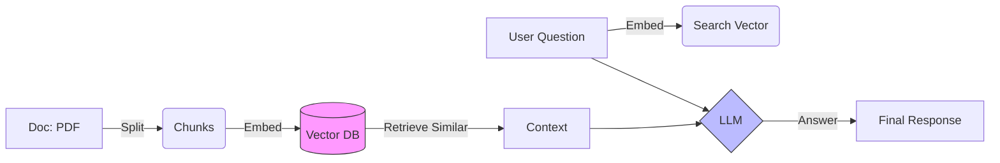

# Week 6 - Day 3: Intro to RAG (Chat with Data)

## Overview
**Week 6 – Day 3**  
**Topic:** Retrieval Augmented Generation (RAG) Concepts  
**Duration:** ~60 minutes

### Learning Objectives
By the end of this lesson, you will be able to:
1. Define **RAG** (Retrieval Augmented Generation).
2. Explain why LLMs need RAG to answer questions about *your* private data.
3. Understand the "Vector Database" concept (roughly).

---

## Lesson Content

### The Problem: The "Cutoff Date" and Privacy

GPT-4 knows everything about the public internet up to its training date.
It knows **Nothing** about:
- Your internal Network Diagram.
- Your "Site B" IP Spreadsheet.
- The incident report you wrote yesterday.

If you paste that data into the prompt, you run out of **Context Window** space.

### The Solution: RAG

**RAG** is an open-book test.
1.  **User Question:** "What is the IP of the Core Switch?"
2.  **Retrieval (Search):** The system searches your PDF/Docs for "Core Switch IP".
3.  **Augmentation (Context):** It finds a paragraph: *"The Core Switch IP is 10.1.1.1."*
4.  **Generation (Answer):** It sends the Question + The Found Paragraph to the LLM.
    - *Prompt:* "Using the context 'The Core Switch IP is 10.1.1.1', answer 'What is the IP?'"
5.  **LLM Answer:** "The IP is 10.1.1.1."

The LLM didn't "know" the IP. It "read" it from the context provided by the search.

### Vector Search (The Magic Index)

How does it find the right paragraph?
It uses **Vectors** (Numbers).
- "King" - "Man" + "Woman" = "Queen".
- It converts text to numbers (Embeddings).
- It searches for text that is "Mathematically Close" in meaning, not just keyword matching.

> [!IMPORTANT]
> **Ethics Checkpoint: Data Sovereignty & Contextual Accuracy**
> RAG allows you to use private data, but it introduces new risks:
> - **Data Residency**: Where is your Vector Database hosted? If you use a cloud vector DB, your private internal docs are now on someone else's server.
> - **Retrieval Bias**: If your search system (Vector DB) only finds *half* of a policy, the LLM will generate a half-true (and potentially dangerous) answer. You are responsible for ensuring the search results are comprehensive.

> [!CAUTION]
> **Ethics Checkpoint: The Accountability Gap**
> If your RAG bot retrieves an outdated runbook and tells a junior admin to `reload` a core switch during peak hours, **who is responsible?**
> - The AI (Claude)? No.
> - The software developer? Unlikely.
> - **You (The Architect)**: You are responsible for the freshness of the data the bot reads. Automated systems amplify human error. If your documentation is stale, your bot is a liability, not an asset.

### Visualizing RAG

---

## Hands-On Exercise

### Exercise: The RAG Architect

**Objective:** design the flow for a "Policy Bot."

**Scenario:** You have a 50-page Employee Handbook PDF.
**Flow:**
1.  **Ingest:** Split PDF into chunks (paragraphs). Save to Vector DB.
2.  **User:** "Can I wear shorts?"
3.  **Retrieve:** System finds chunk: *"Dress code requires business casual. Shorts are not permitted."*
4.  **Generate:** LLM says: "According to the handbook, shorts are not permitted as business casual is required."

**Reflection:**
Without RAG, the LLM would guess (Hallucinate) or say "I don't know." With RAG, it answers accurately based on *your* file.

---

## Interactive Daily Quiz

### Question 1 (Acronym)
**What does RAG stand for?**

A) Really Advanced GPT.  
B) Retrieval Augmented Generation.  
C) Random Access Generator.  
D) Red Amber Green.  

**Correct Answer:** B

**Feedback:**
- **B) ✓ Correct!** Retrieve Data -> Augment Prompt -> Generate Answer.

### Question 2 (Necessity)
**Why can't I just fine-tune the model on my documents?**

A) Fine-tuning is expensive, slow, and hard to update. RAG is real-time and cheaper.  
B) Fine-tuning makes it dumb.  
C) You can.  
D) RAG is harder.  

**Correct Answer:** A

**Feedback:**
- **A) ✓ Correct!** RAG is generally preferred for knowledge retrieval because you can just add a PDF to the folder to "update" the knowledge.

### Question 3 (Limits)
**If the answer is NOT in the documents provided, what should the RAG system do?**

A) Make it up.  
B) Say "I cannot find that information in the provided context."  
C) Search Google.  
D) Crash.  

**Correct Answer:** B

**Feedback:**
- **B) ✓ Correct!** This reduces Hallucinations. "If it's not in the source, don't guess."

### Question 4 (Component)
**What is the database called that stores the text "Embeddings" (numbers)?**

A) SQL Database.  
B) Vector Database.  
C) Spreadsheet.  
D) Floppy Disk.  

**Correct Answer:** B

**Feedback:**
- **B) ✓ Correct!** Specialized for similarity search.

### Question 5 (Analogy)
**RAG is like:**

A) Taking a test from memory.  
B) Taking an open-book test where you look up the answer in the textbook before writing it down.  
C) Cheating.  
D) Guessing.  

**Correct Answer:** B

**Feedback:**
- **B) ✓ Correct!** The system "Looks up" the info first.

---

### Summary
Today you conceptually understood **RAG**. It is the bridge between the "Brain" (LLM) and "Your Facts" (PDFs). Tomorrow, we build one.