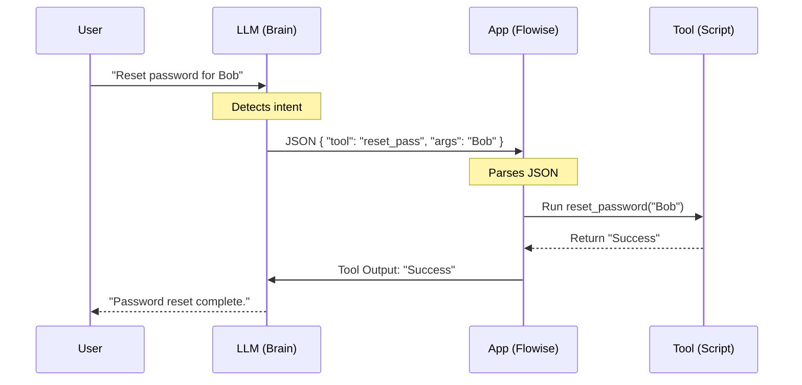

# Week 7 - Day 1: The "Action" Layer (Function Calling)

## Overview
**Week 7 – Day 1**  
**Topic:** Introduction to Function Calling (Tools)  
**Duration:** ~60 minutes

### Learning Objectives
By the end of this lesson, you will be able to:
1. Define **Function Calling** (Tool Use) in the context of LLMs.
2. Explain how a Chatbot "decides" to click a button.
3. Distinguish between "Chat" (Conversation) and "Action" (Execution).

---

## Lesson Content

### The Limitation of Chat

Until now, your bots have been **Passive Talkers**.
- User: "Reset my password."
- Bot: "I cannot do that. Please click this link."

To make them **Active Doers**, we need **Function Calling**.

### How It Works

Function Calling is not magic. It's a specific Prompt & JSON handshake.

**The "Under the Hood" Analogy:**
Remember the wire connecting two nodes in Flowise (Week 6)? That wire isn't just a line; it carries data. In code, that wire is a **JSON Object**. Function calling is just manually writing that connection payload.

1.  **The Definitions:** You give the bot a list of "Tools" in the System Prompt.
    - `reset_password(username)`
    - `check_status(ticket_id)`
2.  **The Trigger:**
    - User: "My email is bob@acme.com, please reset my pass."
3.  **The Decision:**
    - The LLM detects intent.
    - It does *not* reply with text.
    - It replies with a structured JSON: `{"tool": "reset_password", "args": {"username": "bob@acme.com"}}`.
4.  **The Execution:**
    - The Application (Flowise/Python) sees this JSON, runs the actual Python script, and feeds the result back to the LLM.
5.  **The Response:**
    - LLM: "I have successfully reset the password for Bob."

### Visualizing the Flow



### The "Hands" of the AI

Think of the LLM as the **Brain**.
Think of the Tools (APIs) as the **Hands**.
Function Calling is the nerve signal from Brain to Hands.

---

## Hands-On Exercise

### Exercise: The Tool definer

**Objective:** Write a "Tool Definition" for a hypothetical API.

**Scenario:** You have a Python script `get_switch_uptime(ip_address)`.

**Task:** Write the JSON schema that tells the LLM how to use it.

**Solution:**
```json
{
  "name": "get_switch_uptime",
  "description": "Retrieves the uptime of a network switch. Use this when asking about stability or reboot time.",
  "parameters": {
    "type": "object",
    "properties": {
      "ip_address": {
        "type": "string",
        "description": "The IPv4 address of the switch (e.g., 10.1.1.1)"
      }
    },
    "required": ["ip_address"]
  }
}
```

**Reflection:**
If you don't describe the tool well ("description"), the LLM won't know *when* to use it.

---

## Interactive Daily Quiz

### Question 1 (Concept)
**What is "Function Calling" in AI?**

A) Calling a support phone number.  
B) The ability of an LLM to output a structured command (JSON) to run a specific code function instead of standard text.  
C) Writing Python functions.  
D) A video call.  

**Correct Answer:** B

**Feedback:**
- **B) ✓ Correct!** It enables the LLM to interact with external systems.

### Question 2 (Mechanism)
**Does the LLM actually run the code?**

A) Yes, it runs Python internally.  
B) No. It outputs text (JSON) requesting the code be run. The hosting application (e.g., Flowise/LangChain) runs the code.  
C) Yes, it is a computer.  
D) Sometimes.  

**Correct Answer:** B

**Feedback:**
- **B) ✓ Correct!** The LLM is just a text-in/text-out engine. It triggers the action, but doesn't execute it.

### Question 3 (Prompting)
**Where do you define the available tools?**

A) In the user prompt.  
B) In a special "Tools" definition block passed to the API.  
C) In the email.  
D) You don't.  

**Correct Answer:** B

**Feedback:**
- **B) ✓ Correct!** OpenAI and Anthropic have specific API parameters for `tools`.

### Question 4 (Error Handling)
**If the Tool fails (API Error), what happens?**

A) The bot crashes.  
B) The error message is fed back to the LLM, which can then try to fix it or apologize to the user.  
C) The bot laughs.  
D) Nothing.  

**Correct Answer:** B

**Feedback:**
- **B) ✓ Correct!** This feedback loop allows for "Self-Healing" workflows.

### Question 5 (Safety)
**Should you give an LLM a tool called `delete_database()`?**

A) Yes, it's powerful.  
B) No! Only give AI tools that are safe to run or have human approval steps.  
C) Only on weekends.  
D) Yes, if you ask nicely.  

**Correct Answer:** B

**Feedback:**
- **B) ✓ Correct!** Principle of Least Privilege applies to AI Actions.

---

### Summary
Today you learned how to give your Bot **Hands**. Function Calling transforms AI from a "Know-It-All" to a "Do-It-All." Tomorrow, we connect these hands to real APIs.
