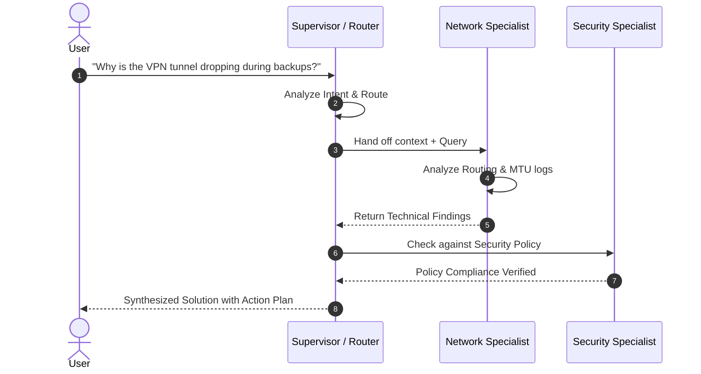

# Week 7 - Day 4: Multi-Agent Patterns & Orchestration

## Overview
**Week 7 – Day 4**  
**Topic:** Multi-Agent Systems (Supervisor/Worker Pattern)  
**Duration:** ~60 minutes

### Learning Objectives
By the end of this lesson, you will be able to:
1. Define **Multi-Agent Architecture** and explain when to transition from single-agent to multi-agent.
2. Explain the **Supervisor/Worker** pattern and state propagation.
3. Build a "Routing Agent" that delegates tasks to specialist sub-agents.
4. Implement context preservation during multi-agent handoffs.

---

## Lesson Content

### Why Multiple Agents?

A single AI agent assigned to handle coding, security auditing, legal compliance, and network troubleshooting often suffers from **context pollution** and **prompt degradation**. As system instructions grow longer, the LLM loses focus on specific constraints.

**Specialization** improves performance dramatically by partitioning responsibilities:
- **Supervisor (Router) Agent:** Analyzes user intent, delegates work, and synthesizes final responses.
- **Network Diagnostic Agent:** Specializes in syslog parsing, ping/traceroute interpretation, and interface configurations.
- **IT Policy & Security Agent:** Specializes in NIST/HIPAA compliance rules and enterprise security policies.
- **Automation Scripting Agent:** Focuses strictly on writing deterministic Python, Bash, or Ansible code.

### The Supervisor Pattern

The **Supervisor Pattern** introduces a central manager that acts as the traffic controller:



### State Handoff & Context Propagation

In multi-agent architectures, the primary technical challenge is **State Handoff**. When the Supervisor delegates to a Specialist, it must decide what context to pass:

1. **Full History Transfer:** Sends the entire conversation thread. High token cost, risk of context pollution.
2. **Selective State Handoff:** Extracts only the relevant variables (e.g., Target IP, Incident Timestamp, Error Code) into a structured payload.
3. **Shared Memory Store:** Uses a centralized key-value store (e.g., Redis or in-memory dictionary) where agents read and write shared state.

#### Python Multi-Agent Router Example:

```python
from typing import Dict, Any

class ITOrchestrator:
    def __init__(self, router_agent, net_agent, sec_agent):
        self.router = router_agent
        self.specialists = {
            "network": net_agent,
            "security": sec_agent
        }

    def process_request(self, user_prompt: str) -> Dict[str, Any]:
        # Step 1: Supervisor classifies intent
        intent = self.router.classify(user_prompt)  # e.g., "network"
        
        # Step 2: Extract structured state
        state_payload = {
            "original_query": user_prompt,
            "target_category": intent,
            "timestamp": "2026-07-29T16:00:00Z"
        }
        
        # Step 3: Delegate to sub-agent
        if intent in self.specialists:
            result = self.specialists[intent].execute(state_payload)
            return {"status": "success", "agent": intent, "response": result}
        
        return {"status": "fallback", "response": "General help desk response."}
```

---

## Hands-On Exercise

### Exercise: The "IT Dept" Multi-Agent Simulator

**Objective:** Design a supervisor routing matrix for an enterprise IT Service Desk.

**Agents Configuration:**
1. **Identity & Auth Bot:** Specializes in Active Directory, OAuth tokens, and password reset flows.
2. **Hardware Procurement Bot:** Handles laptop specs, peripheral requests, and asset inventory.
3. **Supervisor Agent:** Inspects inbound tickets and routes dynamically.

**Routing Rules Matrix:**

| User Keywords / Intent | Primary Target | Shared State Passed |
|------------------------|----------------|--------------------|
| `login`, `MFA`, `SAML`, `password` | Identity & Auth Bot | `user_id`, `auth_method` |
| `screen`, `docking station`, `RAM`, `laptop` | Hardware Procurement Bot | `department`, `asset_id` |

**Sample Execution Walkthrough:**
- **Inbound Ticket:** "My dual monitor docking station stopped charging my laptop."
- **Supervisor Analysis:** Keywords `docking station`, `laptop` detected -> Route to **Hardware Procurement Bot**.
- **Sub-Agent Response:** "Checking inventory for Thunderbolt 4 docks assigned to your user ID..."

---

## Interactive Daily Quiz

### Question 1 (Architecture)
**What is the primary role of the "Supervisor" in a Multi-Agent system?**

A) To execute all technical sub-tasks directly without delegation  
B) To analyze user intent, route tasks to specialized sub-agents, and aggregate results  
C) To bypass rate limits by making duplicate LLM requests  
D) To permanently store logs without user visibility  

**Correct Answer:** B

**Feedback:**
- **B) ✓ Correct!** The Supervisor acts as an orchestrator/router that manages intent classification and delegation to specialist agents.

### Question 2 (Benefit)
**Why is splitting a complex workflow into multiple specialized agents beneficial?**

A) It reduces overall system cost regardless of task complexity  
B) Specialization reduces context pollution and hallucination by giving each agent a focused system prompt and restricted tools  
C) It eliminates the need for system prompts entirely  
D) Multi-agent systems run faster than single-agent API calls  

**Correct Answer:** B

**Feedback:**
- **B) ✓ Correct!** Concentrated system prompts and isolated tool sets lower error rates and prevent prompt conflict.

### Question 3 (Structure)
**Can a sub-agent maintain its own dedicated set of tools?**

A) Yes. For example, a Network Agent may have a `ping`/`traceroute` tool while an HR Agent has an `employee_db` tool  
B) No. Tools can only be defined globally at the Supervisor level  
C) No. Sub-agents are restricted to plain-text output with zero tool access  
D) Yes, but only if all tools are written in C++  

**Correct Answer:** A

**Feedback:**
- **A) ✓ Correct!** Modular tool assignment ensures sub-agents only access the tools required for their specific domain.

### Question 4 (State Management)
**Which state handoff strategy best prevents context pollution during agent transfers?**

A) Passing the entire chat history with every API request  
B) Extracting only relevant variables into a structured payload (Selective State Handoff)  
C) Clearing all conversation history without passing any data  
D) Hardcoding static responses in the router  

**Correct Answer:** B

**Feedback:**
- **B) ✓ Correct!** Selective State Handoff keeps prompt size compact and focused on the necessary parameters.

### Question 5 (Trade-offs)
**When should you NOT use a Multi-Agent architecture?**

A) When the domain covers multiple unrelated enterprise systems  
B) When the task is simple and single-step, where multi-agent orchestration adds unnecessary latency and complexity  
C) When team members need different authorization levels  
D) When using function calling  

**Correct Answer:** B

**Feedback:**
- **B) ✓ Correct!** Avoid over-engineering. Simple tasks are best handled by a single, well-prompted agent.

---

### Summary
Today you mastered **Multi-Agent Orchestration**. You learned how the Supervisor/Worker pattern separates concerns, prevents prompt degradation, and how to manage state transfer between specialist agents. Tomorrow, we combine these concepts into a production-grade Capstone project.